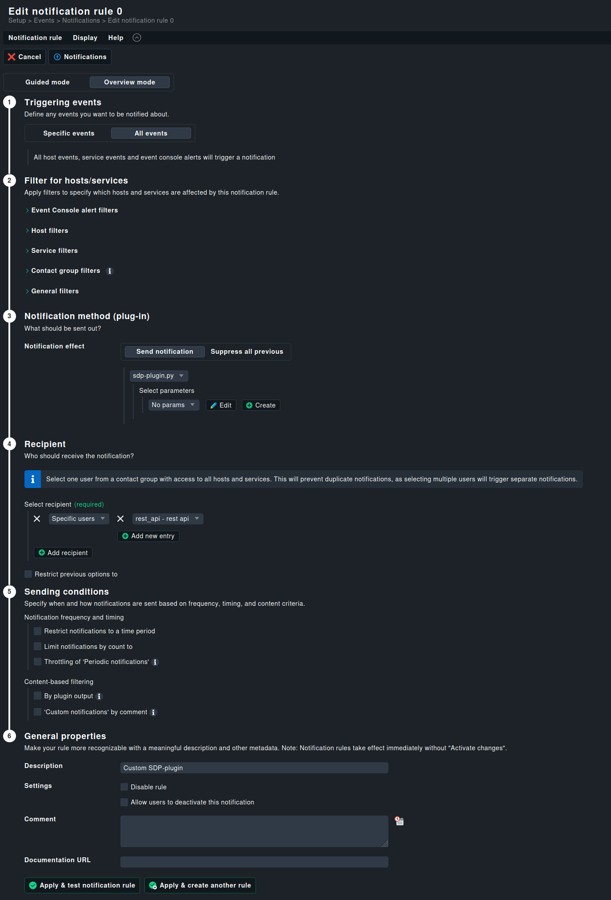

# Checkmk - Service Desk Plus Integration

This Python application integrates **Checkmk** with **Service Desk Plus** via its REST API. It automatically creates tickets based on host or service notifications.

---

## 📚 Documentation

- [API Reference](/docs/app/README.md)
- [Checkmk Setup Guide](/docs/checkmk/README.md)
- [Service Desk Plus Guide](/docs/checkmk/README.md)

---

## 🚀 Setup Guide

### 🐳 Docker Installation

#### ✅ Requirements

- [Docker Engine](https://docs.docker.com/engine/install/)
- [Service Desk Plus API user](/docs/sdp/setup.md)
- [Checkmk API user](/docs/checkmk/setup.md)
- Admin Access to Checkmk master host (CLI, HTTPS)
- Admin Access to Service Desk Plus (HTTPS)

#### 📂 Script Installation

1. Copy the `sdp-plugin.py` script to:

   ```
   /omd/sites/<your-checkmk-site>/local/share/check_mk/notifications
   ```

2. Make the script executable:

   ```
   chmod +x sdp-plugin.py
   ```

3. On the Checkmk master, install the required Python package:

   ```
   sudo apt install python3-requests
   ```

4. Configure a notification rule in the Checkmk Web UI using this script.

   

---

### ▶️ Starting the Application

1. Clone the Git repository:

   ```bash
   git clone <repository-url>
   cd <repository-directory>
   ```

2. Copy the sample config file and fill in the required variables:

   ```bash
   cp conf.py.sample conf.py
   ```

3. Start the Docker service:

   ```bash
   docker compose up -d
   ```

4. See service and hosts requests automatically being created :)

---
